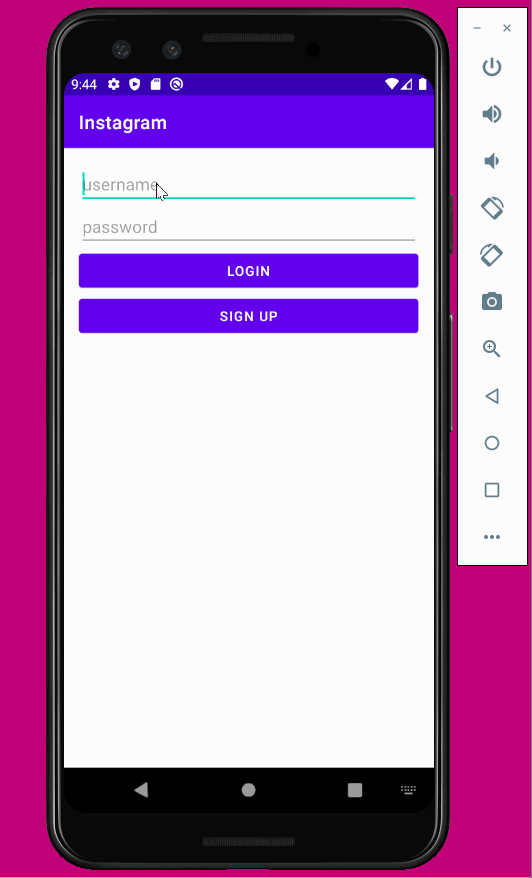

# Project 3 - *Parstagram*

**Parstagram** is a photo sharing app similar to Instagram but using Parse as its backend.

Time spent: **48** hours spent in total

## User Stories

The following **required** functionality is completed:

- [X] User can sign up to create a new account using Parse authentication.
- [X] User can log in and log out of his or her account.
- [X] The current signed in user is persisted across app restarts.
- [X] User can take a photo, add a caption, and post it to "Instagram".

The following **optional** features are implemented:

- [ ] User sees app icon in home screen and styled bottom navigation view
- [ ] Style the feed to look like the real Instagram feed.
- [ ] After the user submits a new post, show an indeterminate progress bar while the post is being uploaded to Parse.

The following **additional** features are implemented:

- [ ] List anything else that you can get done to improve the app functionality!

## Video Walkthrough

Here's a walkthrough of implemented user stories:

GIF created with [LiceCap](http://www.cockos.com/licecap/).

## Notes

Describe any challenges encountered while building the app.
Some challenges that I faced when building this app was that I had error with my build.gradle, so when I ran the program, it would not work. I fixed this problem by asking a TA's help to
look over my code and see what was wrong. The TA transferred my code to a new project that had no build issues. Another challenge that I had  was that my posts were not being posted. 
To solve this problem, I went to the back4app website and changed the permissions on the post table to read and write to be authenticated. Another problem that I had was that
I had some issues with the Parse library being recognized, so I had to change some of the code in my android manifest file and then it started to work. 
## Open-source libraries used

- [Android Async HTTP](https://github.com/codepath/CPAsyncHttpClient) - Simple asynchronous HTTP requests with JSON parsing
- [Glide](https://github.com/bumptech/glide) - Image loading and caching library for Android

## License

    Copyright [yyyy] [name of copyright owner]

    Licensed under the Apache License, Version 2.0 (the "License");
    you may not use this file except in compliance with the License.
    You may obtain a copy of the License at

        http://www.apache.org/licenses/LICENSE-2.0

    Unless required by applicable law or agreed to in writing, software
    distributed under the License is distributed on an "AS IS" BASIS,
    WITHOUT WARRANTIES OR CONDITIONS OF ANY KIND, either express or implied.
    See the License for the specific language governing permissions and
    limitations under the License.
